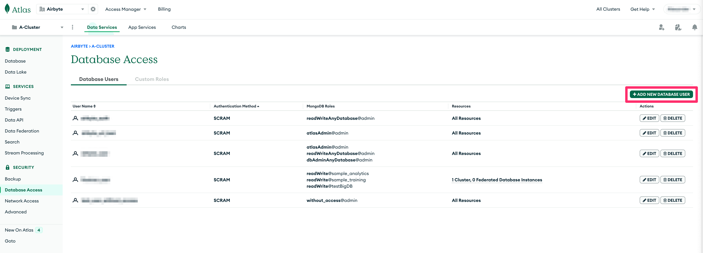
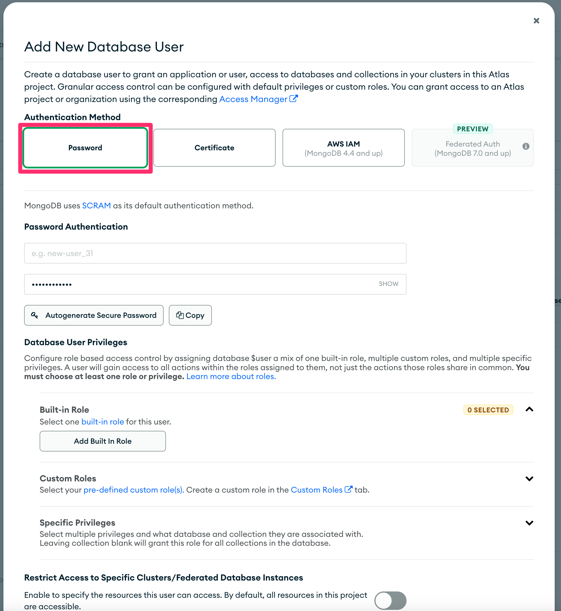
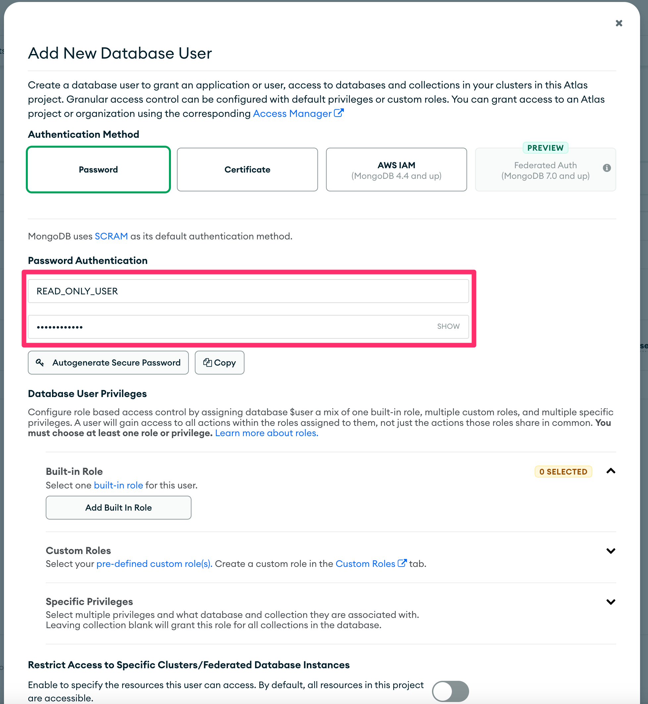
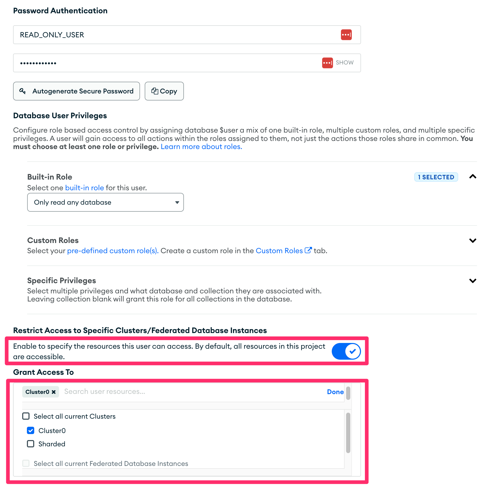
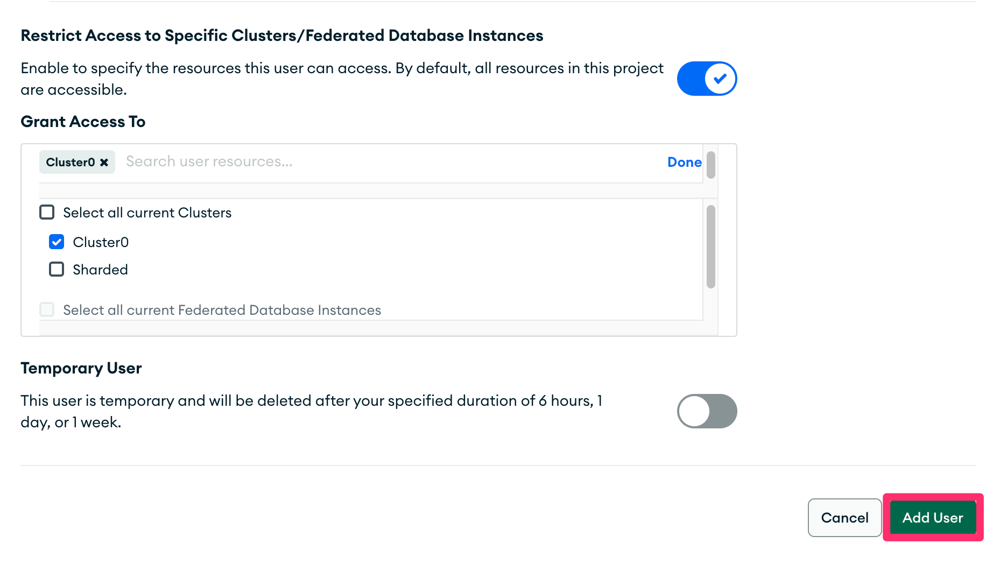
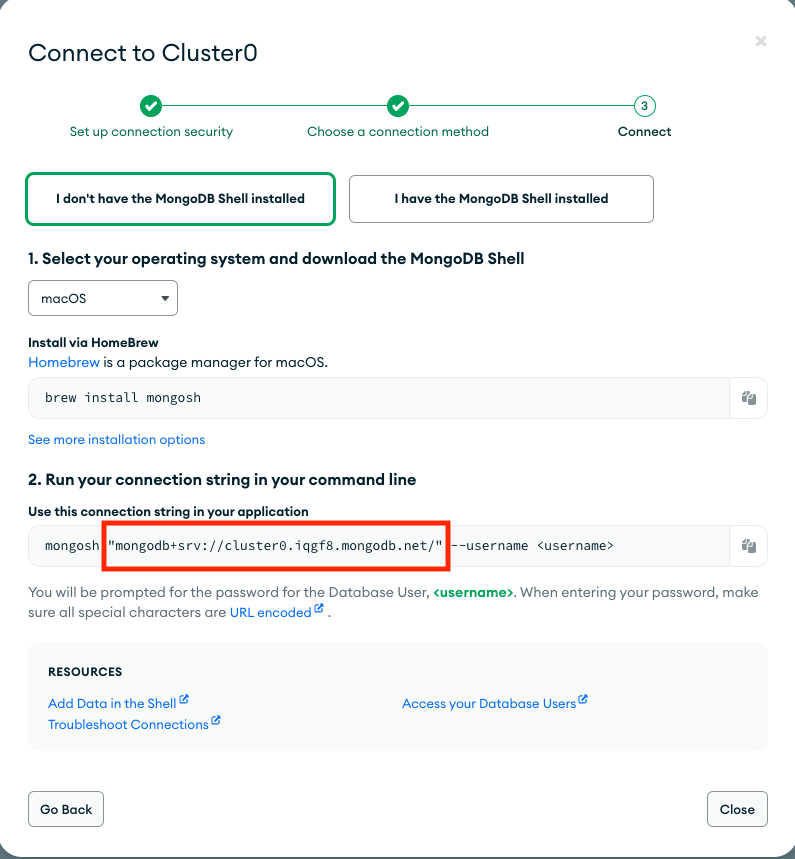

# Mongo DB

Airbyte's certified MongoDB connector offers the following features:

* [Change Data Capture (CDC)](https://docs.airbyte.com/understanding-airbyte/cdc) via [MongoDB's change streams](https://www.mongodb.com/docs/manual/changeStreams/)/[Replica Set Oplog](https://www.mongodb.com/docs/manual/core/replica-set-oplog/).
* Reliable replication of any collection size with [checkpointing](https://docs.airbyte.com/understanding-airbyte/airbyte-protocol/#state--checkpointing) and chunking of data reads.

## Quick Start

Here is an outline of the minimum required steps to configure a MongoDB connector:
1. Create or discover the configuration of a [MongoDB replica set](https://www.mongodb.com/docs/manual/replication/), either hosted in [MongoDB Atlas](https://www.mongodb.com/atlas/database) or self-hosted.
2. Create a new MongoDB source in the Airbyte UI
3. (Airbyte Cloud Only) Allow inbound traffic from Airbyte IPs

Once this is complete, you will be able to select MongoDB as a source for replicating data.

#### Step 1: Create a dedicated read-only MongoDB user

These steps create a dedicated, read-only user for replicating data.  Alternatively, you can use an existing MongoDB user with
access to the database.

##### MongoDB Atlas

1. Log in to the MongoDB Atlas dashboard.
2. From the dashboard, click on "Database Access" under "Security"


3. Click on the "+ ADD NEW DATABASE USER" button.



4. On the "Add new Database User" modal dialog, choose "Password" for the "Authentication Method".



5. In the "Password Authentication" section, set the username to `READ_ONLY_USER` in the first text box and set a password in the second text box.



6. Under "Database User Privileges", click on "Select one built-in role for this user" under "Built-in Role" and choose "Only read any database".


7. Enable "Restrict Access to Specific Clusters/Federated Database instances" and enable only those clusters/database that you wish to replicate.



8. Click on "Add User" at the bottom to save the user.



##### Self Hosted

These instructions assume that the MongoDB shell is installed.  To install the MongoDB shell, please follow [these instructions](https://www.mongodb.com/docs/mongodb-shell/install/#std-label-mdb-shell-install).

1. From a terminal window, launch the MongoDB shell:
```shell
> mongosh <connection string to cluster> --username <user with admin permissions>
```  
2. Switch to the `admin` database:
```shell
test> use admin
switched to db admin
```
3. Create a `READ_ONLY_USER` with the `read` role:
```javascript
admin> db.createUser({user: "READ_ONLY_USER", pwd: "READ_ONLY_PASSWORD", roles: [{role: "read", db: "TARGET_DATABASE"}]})
```
Replace `READ_ONLY_PASSWORD` with a password of your choice and `TARGET_DATABASE` with the name of the database to be replicated.
4. Next, enable authentication, if not already enabled.  Start by editing the `/etc/mongodb.conf` by adding/editing these specific keys:
```yaml
net:
  bindIp: 0.0.0.0

security:
  authorization: enabled
```
Setting the `bindIp` key to `0.0.0.0` will allow connections to database from any IP address.  Setting the `security.authorization` key to `enabled` will enable security and only allow authenticated users to access the database.

#### Step 2: Discover the MongoDB cluster connection string

These steps outline how to discover the connection configuration of your MongoDB instance.

##### MongoDB Atlas

Atlas is MongoDB's [cloud-hosted offering](https://www.mongodb.com/atlas/database).  Below are the steps to discover
the connection configuration for a MongoDB Atlas-hosted replica set cluster:

1. Log in to the [MongoDB Atlas dashboard](https://cloud.mongodb.com/).
2. From the dashboard, click on the "Connect" button of the source cluster.


3. On the "Connect to <cluster name>" modal dialog, select "Shell" under the "Access your data through tools" section.


4. Copy the connection string from the entry labelled #2 on the modal dialog, removing/avoiding the quotation marks.



##### Self Hosted Cluster

Self-hosted clusters are MongoDB instances that are hosted outside of [MongoDB Atlas](https://www.mongodb.com/atlas/database).  Below are the steps to discover
the connection configuration for a MongoDB self-hosted replica set cluster.

1.  Refer to the [MongoDB connection string documentation](https://www.mongodb.com/docs/manual/reference/connection-string/#find-your-self-hosted-deployment-s-connection-string) for instructions
on discovering a self-hosted deployment connection string.

#### Step 3: Configure the Airbyte MongoDB Source

To configure the Airbyte MongoDB source, use the database credentials and connection string from steps 1 and 2, respectively.
The source will test the connection to the MongoDB instance

## Replication Methods

The MongoDB source utilizes change data capture (CDC) as a reliable way to keep your data up to date.

#### CDC

Airbyte utilizes [the change streams feature](https://www.mongodb.com/docs/manual/changeStreams/) of a [MongoDB replica set](https://www.mongodb.com/docs/manual/replication/) to incrementally capture inserts, updates and deletes using a replication plugin. To learn more how Airbyte implements CDC, refer to [Change Data Capture (CDC)](https://docs.airbyte.com/understanding-airbyte/cdc/).

## Limitations & Troubleshooting

* Currently only supports [replica set](https://www.mongodb.com/docs/manual/replication/) cluster types.
* Schema discovery uses [sampling](https://www.mongodb.com/docs/manual/reference/operator/aggregation/sample/) of 1000 documents to collect all distinct top-level fields.  This is modelled after [MongoDB Compass sampling](https://www.mongodb.com/docs/compass/current/sampling/) and is used for efficiency.
* TLS/SSL is required by this connector. TLS/SSL is enabled by default for MongoDB Atlas clusters. To enable TSL/SSL connection for a self-hosted MongoDB instance, please refer to [MongoDb Documentation](https://docs.mongodb.com/manual/tutorial/configure-ssl/).
* Views, capped collections and clustered collections are not supported.
* Collections with different data types for the values in the `_id` field among the documents in a collection are not supported.  All `_id` values within the collection must be the same data type.
* [MongoDB's change streams](https://www.mongodb.com/docs/manual/changeStreams/) are based on the [Replica Set Oplog](https://www.mongodb.com/docs/manual/core/replica-set-oplog/), which has retention limitations.  Syncs that run less frequently than the retention period of the oplog may encounter issues with missing data.

## Сonfiguration Parameters

| Parameter Name                             | Description                                                                                                                                                                                                                                                                                                                                                        |
|:-------------------------------------------|:-------------------------------------------------------------------------------------------------------------------------------------------------------------------------------------------------------------------------------------------------------------------------------------------------------------------------------------------------------------------|
| Cluster Type                               | The type of the MongoDB cluster ([MongoDB Atlas](https://www.mongodb.com/atlas/database) replica set or self-hosted replica set).                                                                                                                                                                                                                                  |
| Connection String                          | The connection string of the source MongoDB cluster.  For Atlas hosted clusters, see [the quick start guide](#step-2-discover-the-mongodb-cluster-connection-string) for steps to find the connection string.  For self-hosted clusters, refer to the [MongoDB connection string documentation](https://www.mongodb.com/docs/manual/reference/connection-string/#find-your-self-hosted-deployment-s-connection-string) for more information. 
| Database Name                              | The name of the database that contains the source collection(s) to sync.                                                                                                                                                                                                                                                                                           | 
| Username                                   | The username which is used to access the database.  Required for MongoDB Atlas clusters.                                                                                                                                                                                                                                                                           |
| Password                                   | The password associated with this username. Required for MongoDB Atlas clusters.                                                                                                                                                                                                                                                                                   |
| Authentication Source                      | (MongoDB Atlas clusters only) Specifies the database that the supplied credentials should be validated against. Defaults to `admin`.  See the [MongoDB documentation](https://www.mongodb.com/docs/manual/reference/connection-string/#mongodb-urioption-urioption.authSource) for more details.                                                                   |
| Initial Waiting Time in Seconds (Advanced) | The amount of time the connector will wait when it launches to determine if there is new data to sync or not. Defaults to 300 seconds. Valid range: 120 seconds to 1200 seconds.                                                                                                                                                                                   |
| Size of the queue (Advanced)               | The size of the internal queue. This may interfere with memory consumption and efficiency of the connector, please be careful.                                                                                                                                                                                                                                     |

For more information regarding configuration parameters, please see [MongoDb Documentation](https://docs.mongodb.com/drivers/java/sync/v4.10/fundamentals/connection/).

## Changelog

| Version | Date       | Pull Request                                             | Subject                                                                                                   |
|:--------| :--------- |:---------------------------------------------------------| :-------------------------------------------------------------------------------------------------------- |
| 0.2.5   | 2023-07-27 | [28815](https://github.com/airbytehq/airbyte/pull/28815) | Revert back to version 0.2.0                                                                              |
| 0.2.4   | 2023-07-26 | [28760](https://github.com/airbytehq/airbyte/pull/28760) | Fix bug preventing some syncs from succeeding when collecting stats                                       |
| 0.2.3   | 2023-07-26 | [28733](https://github.com/airbytehq/airbyte/pull/28733) | Fix bug preventing syncs from discovering field types                                                     |
| 0.2.2   | 2023-07-25 | [28692](https://github.com/airbytehq/airbyte/pull/28692) | Fix bug preventing statistics retrieval from views                                                        |
| 0.2.1   | 2023-07-21 | [28527](https://github.com/airbytehq/airbyte/pull/28527) | Log server information                                                                                    |
| 0.2.0   | 2023-06-26 | [27737](https://github.com/airbytehq/airbyte/pull/27737) | License Update: Elv2                                                                                      |
| 0.1.19  | 2022-10-07 | [17614](https://github.com/airbytehq/airbyte/pull/17614) | Increased discover performance                                                                            |
| 0.1.18  | 2022-10-05 | [17590](https://github.com/airbytehq/airbyte/pull/17590) | Add ability to enforce SSL in MongoDB connector and check logic                                           |
| 0.1.17  | 2022-09-08 | [16401](https://github.com/airbytehq/airbyte/pull/16401) | Fixed bug with empty strings in fields with _aibyte_transform_                                            |
| 0.1.16  | 2022-08-18 | [14356](https://github.com/airbytehq/airbyte/pull/14356) | DB Sources: only show a table can sync incrementally if at least one column can be used as a cursor field |
| 0.1.15  | 2022-06-17 | [13864](https://github.com/airbytehq/airbyte/pull/13864) | Updated stacktrace format for any trace message errors                                                    |
| 0.1.14  | 2022-05-05 | [12428](https://github.com/airbytehq/airbyte/pull/12428) | JsonSchema: Add properties to fields with type 'object'                                                   |
| 0.1.13  | 2022-02-21 | [10276](https://github.com/airbytehq/airbyte/pull/10276) | Create a custom codec registry to handle DBRef MongoDB objects                                            |
| 0.1.12  | 2022-02-14 | [10256](https://github.com/airbytehq/airbyte/pull/10256) | (unpublished) Add `-XX:+ExitOnOutOfMemoryError` JVM option                                                |
| 0.1.11  | 2022-01-10 | [9238](https://github.com/airbytehq/airbyte/pull/9238)   | Return only those collections for which the user has privileges                                           |
| 0.1.10  | 2021-12-30 | [9202](https://github.com/airbytehq/airbyte/pull/9202)   | Update connector fields title/description                                                                 |
| 0.1.9   | 2021-12-07 | [8491](https://github.com/airbytehq/airbyte/pull/8491)   | Configure 10000 limit doc reading during Discovery step                                                   |
| 0.1.8   | 2021-11-29 | [8306](https://github.com/airbytehq/airbyte/pull/8306)   | Added milliseconds for date format for cursor                                                             |
| 0.1.7   | 2021-11-22 | [8161](https://github.com/airbytehq/airbyte/pull/8161)   | Updated Performance and updated cursor for timestamp type                                                 |
| 0.1.5   | 2021-11-17 | [8046](https://github.com/airbytehq/airbyte/pull/8046)   | Added milliseconds to convert timestamp to datetime format                                                |
| 0.1.4   | 2021-11-15 | [7982](https://github.com/airbytehq/airbyte/pull/7982)   | Updated Performance                                                                                       |
| 0.1.3   | 2021-10-19 | [7160](https://github.com/airbytehq/airbyte/pull/7160)   | Fixed nested document parsing                                                                             |
| 0.1.2   | 2021-10-07 | [6860](https://github.com/airbytehq/airbyte/pull/6860)   | Added filter to avoid MongoDb system collections                                                          |
| 0.1.1   | 2021-09-21 | [6364](https://github.com/airbytehq/airbyte/pull/6364)   | Source MongoDb: added support via TLS/SSL                                                                 |
| 0.1.0   | 2021-08-30 | [5530](https://github.com/airbytehq/airbyte/pull/5530)   | New source: MongoDb ported to java                                                                        |
